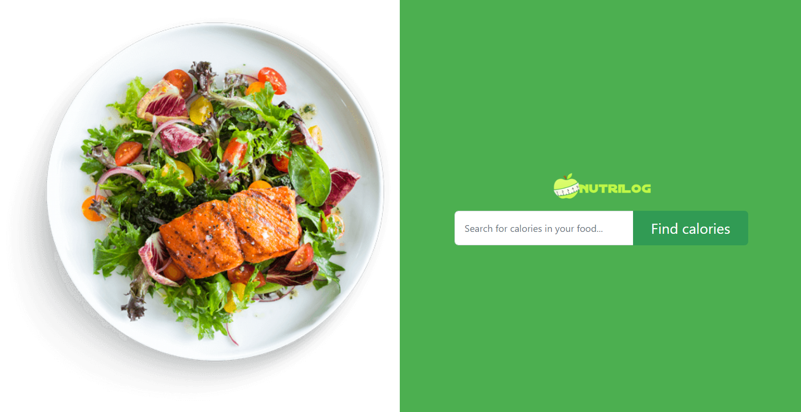
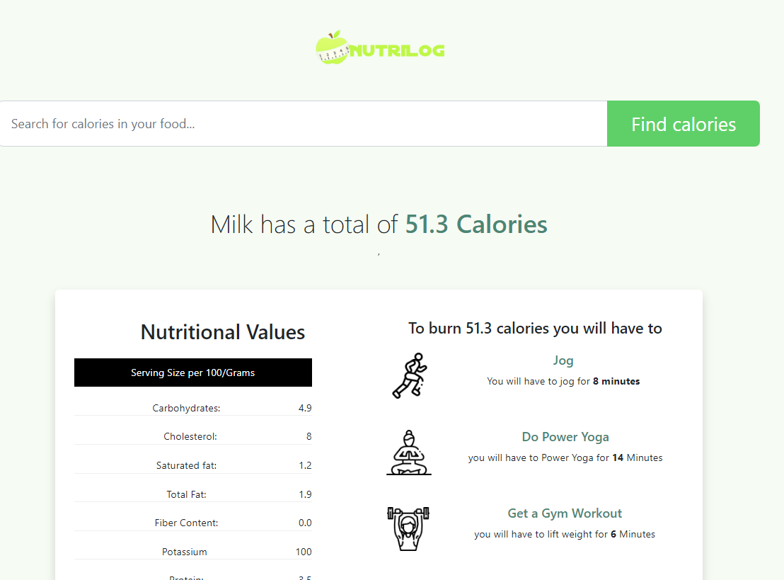
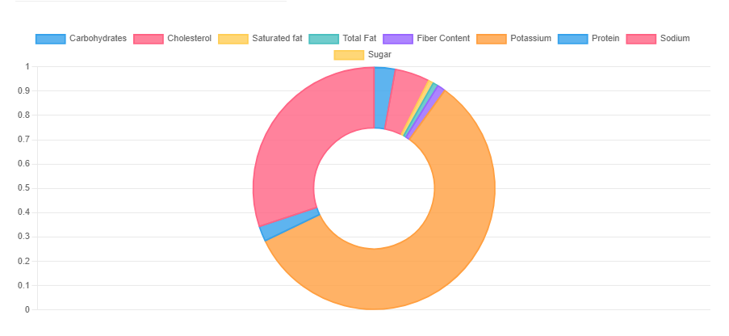

# NutriLog 

NutriLog is a web application that helps users find the calorie content and nutritional values of various foods. It provides a user-friendly interface to search for foods and view their nutritional information.



## Features

- **Search**: Users can search for foods by entering the food name in the search bar.
- **Calorie Information**: Displays the total calorie content of the food.
- **Nutritional Values**: Provides detailed nutritional information such as carbohydrates, cholesterol, saturated fat, total fat, fiber content, potassium, protein, sodium, and sugar.
- **Calorie Burning Suggestions**: Offers suggestions on different physical activities required to burn the calories consumed.
- **Visual Representation**: Presents nutritional values in a visually appealing doughnut chart.

  
  

## Technologies Used

- **Frontend**: HTML, CSS (Bootstrap), JavaScript (Chart.js)
- **Backend**: Django (Python)
- **APIs**: API Ninjas

## Installation

1. Clone the repository:

   ```bash
   git clone https://github.com/your-username/nutrilab-food-calorie-finder.git
   ```

2. Install dependencies:

   ```bash
   pip install -r requirements.txt
   ```

3. Run the development server:

   ```bash
   python manage.py runserver
   ```

4. Access the application at [http://localhost:8000](http://localhost:8000).

## Usage

1. Enter the name of the food you want to search for in the search bar.
2. Press the "Find calories" button.
3. View the calorie content and nutritional values of the food.
4. Explore calorie burning suggestions and nutritional information presented in the doughnut chart.
